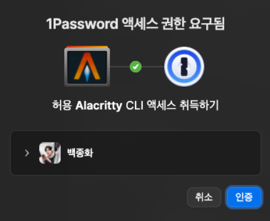

> TL;DR -- 1Password's credential_process is secure but triggers an authorization popup on every AWS CLI call, which becomes unbearable with tools like k9s that call `aws eks get-token` in the background. aws-vault solves this by injecting credentials into a subshell -- no popups, same security via OS keychain encryption.

## Recap from the Previous Post

In a [previous post](/posts/aws-credentials-1password), I replaced plaintext keys in `~/.aws/credentials` with 1Password's `credential_process`. Security was definitely stronger, but...

## The Problem: Popup Hell

### Authorization Prompt on Every Call

```bash
aws s3 ls  # popup
aws sts get-caller-identity  # popup
terraform plan  # popup
```

At first I tolerated it -- "it's for security, after all."

### Then Came k9s

The real pain was with tools like k9s and Lens.

```bash
k9s
```

When connecting to an EKS cluster, kubeconfig triggers `aws eks get-token`:

```yaml
users:
- name: arn:aws:eks:ap-northeast-2:XXXXXXXXXXXX:cluster/my-cluster
  user:
    exec:
      command: aws
      args:
        - eks
        - get-token
        - --cluster-name
        - my-cluster
```

k9s calls this periodically in the background. The result:

- Popup every few minutes
- Focus stolen while I'm in the middle of something
- k9s freezes until I click the popup



Lens had the exact same issue.

### I Looked for a Fix, But...

1Password CLI's authorization popup **cannot be disabled**.

- Official docs: no mention of it
- 1Password community: "this is intentional by security design"
- GitHub Issues: no solution

They say re-requests within 10 minutes skip the popup, but opening a new terminal tab or window triggers it again every time.

## The Alternative: aws-vault

### Installation and Setup

```bash
brew install aws-vault

# Register profiles (encrypted in keychain)
aws-vault add dev
aws-vault add prd
```

### ~/.aws/config

```ini
[profile dev]
region = ap-northeast-2
output = json

[profile prd]
region = ap-northeast-2
output = json
```

Remove the `credential_process` line. aws-vault injects credentials via environment variables.

### Usage: Subshell Approach

```bash
aws-vault exec dev
# enters a subshell (prompt doesn't change)

aws s3 ls  # no popup
k9s        # no popup!
terraform plan  # no popup

exit  # leave the subshell
```

Inside the subshell, `AWS_ACCESS_KEY_ID`, `AWS_SECRET_ACCESS_KEY`, and `AWS_SESSION_TOKEN` are set as environment variables, so all AWS tools work without popups.

### Shell Aliases

```bash
# ~/.zshrc
alias av="aws-vault"
alias avl="aws-vault login"        # console login
# Subshell entry
alias avd="aws-vault exec dev"
alias avp="aws-vault exec prd"
# Single command
alias avrd="aws-vault exec dev --"
alias avrp="aws-vault exec prd --"
```

```bash
avd        # enter dev subshell
avp        # enter prd subshell
avl dev    # browser login to AWS Console

avrd kubectl get pods  # run a single command in dev
```

## aws-vault's Downsides

It's not perfect.

### Account Switching Is Clunky

```bash
avd       # enter dev
# working...
avp       # want to switch to prd
# aws-vault: error: running in an existing aws-vault subshell

exit      # have to exit first
avp       # then enter prd
```

You can't switch profiles from inside a subshell. You must `exit` first.

### Workaround: Separate Terminal Tabs

```
Tab 1: avd -> dev only (k9s dev)
Tab 2: avp -> prd only (k9s prd)
```

Keep different environment subshells in separate tabs and you never need to switch.

## 1Password vs aws-vault Comparison

| Aspect | 1Password credential_process | aws-vault |
|--------|------------------------------|-----------|
| Security | 1Password encryption | macOS Keychain encryption |
| Profile switching | `--profile dev` (easy) | `exit` then `avp` (clunky) |
| Popups | On every call | None (inside subshell) |
| k9s/Lens | Popup hell | Smooth |
| AWS Console login | Separate | `aws-vault login` |
| Initial setup | Complex | Simple |

## Conclusion: Choose Based on Your Workflow

### 1Password is better when:
- You switch accounts very frequently (every few minutes)
- You only run CLI commands occasionally
- You can tolerate the popups

### aws-vault is better when:
- You work in one account for extended periods
- You use tools like k9s or Lens that continuously access AWS
- You hate popups

I settled on **aws-vault**. Once I adopted the separate-tabs-per-environment pattern to handle account switching, the popup-free experience was overwhelmingly better.

## Keychain Tip

In the Keychain Access app, find the "aws-vault" keychain:

1. Right-click -> **Change Settings for Keychain**
2. Uncheck **Lock after X minutes of inactivity** or increase the timeout

This way you only need to enter the keychain password once a day.

---

## References

- [aws-vault GitHub](https://github.com/99designs/aws-vault)
- [Previous post: Securing AWS Credentials with 1Password](/posts/aws-credentials-1password)
