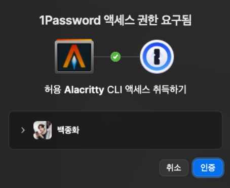

## 이전 글 요약

[지난 글](/posts/aws-credentials-1password)에서 `~/.aws/credentials`의 평문 키를 1Password `credential_process`로 대체했습니다. 보안은 확실히 강화됐지만...

## 문제: 팝업 지옥

### 매 호출마다 권한 요청

```bash
aws s3 ls  # 팝업
aws sts get-caller-identity  # 팝업
terraform plan  # 팝업
```

처음엔 "보안을 위해서니까" 하고 참았습니다.

### k9s의 경우

진짜 문제는 k9s, Lens 같은 도구였습니다.

```bash
k9s
```

EKS 클러스터에 접근하면 kubeconfig에서 `aws eks get-token`이 실행됩니다:

```yaml
users:
- name: arn:aws:eks:ap-northeast-2:123456789:cluster/my-cluster
  user:
    exec:
      command: aws
      args:
        - eks
        - get-token
        - --cluster-name
        - my-cluster
```

k9s는 백그라운드에서 주기적으로 이걸 호출합니다. 결과:

- 몇 분마다 팝업
- 작업 중 갑자기 포커스 빼앗김
- 팝업 누르기 전까지 k9s 멈춤



Lens도 동일한 문제.

### 해결책을 찾아봤지만...

1Password CLI의 권한 팝업은 **비활성화 불가능**입니다.

- 공식 문서: 언급 없음
- 1Password 커뮤니티: "보안 설계상 의도된 동작"
- GitHub Issues: 해결책 없음

10분 내 재요청 시 팝업 스킵된다고 하지만, 새 터미널 탭/창 열면 무조건 다시 뜹니다.

## 대안: aws-vault

### 설치 및 설정

```bash
brew install aws-vault

# 프로필 등록 (키체인에 암호화 저장)
aws-vault add dev
aws-vault add prd
```

### ~/.aws/config

```ini
[profile dev]
region = ap-northeast-2
output = json

[profile prd]
region = ap-northeast-2
output = json
```

`credential_process` 라인 삭제. aws-vault가 환경변수로 자격증명을 주입합니다.

### 사용법: 서브쉘 방식

```bash
aws-vault exec dev
# → 서브쉘 진입, 프롬프트 변경 없음

aws s3 ls  # 팝업 없음
k9s        # 팝업 없음!
terraform plan  # 팝업 없음

exit  # 서브쉘 종료
```

서브쉘 안에서는 `AWS_ACCESS_KEY_ID`, `AWS_SECRET_ACCESS_KEY`, `AWS_SESSION_TOKEN` 환경변수가 설정되어 있어서 모든 AWS 도구가 팝업 없이 작동합니다.

### Alias 설정

```bash
# ~/.zshrc
alias av="aws-vault"
alias avl="aws-vault login"        # 콘솔 로그인
# 서브쉘 진입
alias avd="aws-vault exec dev"
alias avp="aws-vault exec prd"
# 단일 명령
alias avrd="aws-vault exec dev --"
alias avrp="aws-vault exec prd --"
```

```bash
avd        # dev 서브쉘 진입
avp        # prd 서브쉘 진입
avl dev    # AWS 콘솔 브라우저 로그인

avrd kubectl get pods  # dev에서 단일 명령 실행
```

## aws-vault의 단점

완벽하진 않습니다.

### 계정 전환이 번거로움

```bash
avd       # dev 진입
# 작업 중...
avp       # prd로 전환하고 싶음
# aws-vault: error: running in an existing aws-vault subshell

exit      # 먼저 나가야 함
avp       # 그 다음 prd 진입
```

서브쉘 안에서 다른 프로필로 전환 불가. 반드시 `exit` 후 재진입.

### 해결책: 터미널 탭 분리

```
탭 1: avd → dev 전용 (k9s dev)
탭 2: avp → prd 전용 (k9s prd)
```

각 탭에서 다른 환경 서브쉘을 유지하면 전환 없이 작업 가능.

## 1Password vs aws-vault 비교

| 항목 | 1Password credential_process | aws-vault |
|------|------------------------------|-----------|
| 보안 | 1Password 암호화 | macOS Keychain 암호화 |
| 프로필 전환 | `--profile dev` (쉬움) | `exit` → `avp` (번거로움) |
| 팝업 | 매 호출마다 | 없음 (서브쉘 내) |
| k9s/Lens | 팝업 지옥 | 쾌적 |
| AWS 콘솔 로그인 | 별도 | `aws-vault login` |
| 초기 설정 | 복잡함 | 단순함 |

## 결론: 작업 패턴에 따라 선택

### 1Password가 나은 경우
- 계정 전환이 매우 잦음 (분 단위)
- CLI 명령만 가끔 실행
- 팝업 감수 가능

### aws-vault가 나은 경우
- 한 계정에서 오래 작업
- k9s, Lens 등 지속적 AWS 접근 도구 사용
- 팝업 싫음

저는 **aws-vault**로 정착했습니다. 터미널 탭 분리로 계정 전환 불편함을 해결하니, 팝업 없는 쾌적함이 압도적으로 좋습니다.

## 키체인 팁

Keychain Access 앱에서 "aws-vault" 키체인:

1. 우클릭 → **Change Settings for Keychain**
2. **Lock after X minutes of inactivity** 체크 해제 또는 시간 늘리기

이러면 하루에 키체인 패스워드 한 번만 입력하면 됩니다.

---

## 참고

- [aws-vault GitHub](https://github.com/99designs/aws-vault)
- [이전 글: AWS Credentials 보안 강화 - 1Password](/posts/aws-credentials-1password)
