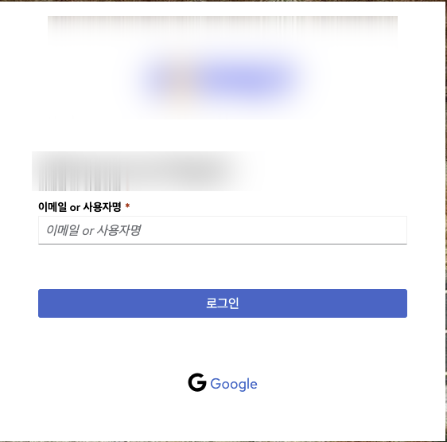
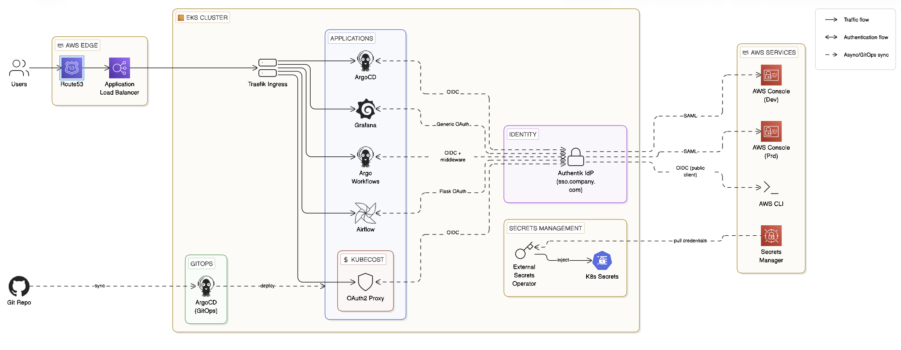
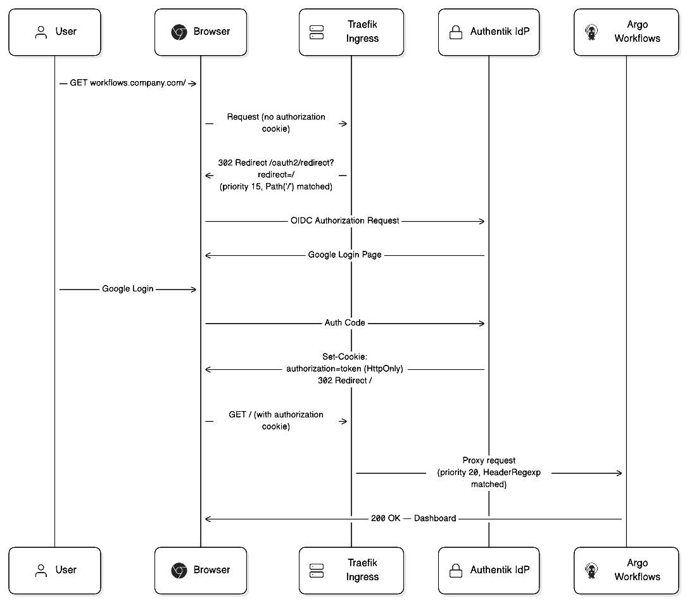
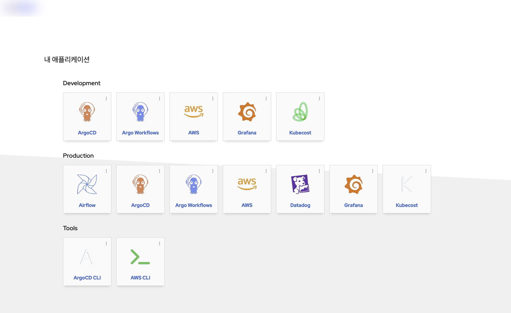

> **TL;DR**: Authentik으로 5개 서비스를 단일 SSO로 통합했다. 서비스마다 프로토콜이 달라 OIDC·Generic OAuth·oauth2-proxy·SAML 4가지 패턴을 써야 했고, Traefik v3 문법 변경과 무한 리다이렉트 등 예상치 못한 삽질이 많았다.

---

## 프로젝트 요약

| | |
|--|--|
| **역할** | DevOps Engineer (설계 · 구현 · 운영) |
| **기간** | 2026년 초 |
| **규모** | EKS 클러스터 2개 (dev / prd), 연동 서비스 5개 |
| **기술 스택** | Authentik · OIDC · OAuth2 · SAML · Traefik · ArgoCD · External Secrets · AWS EKS |
| **핵심 성과** | 서비스별 개별 계정 → 구글 계정 단일 로그인 / 장기 자격증명(IAM User) 전면 제거 / 온보딩 계정 작업 수동 → 자동화 |

---

## 들어가며

DevOps 팀에서 클러스터 내 서비스가 늘어나면서 인증 관리가 점점 골치가 됐다.

- ArgoCD 계정 따로
- Grafana 계정 따로
- Airflow 계정 따로
- Argo Workflows 계정 따로
- Kubecost는 아예 인증이 없어서 IP 제한만 걸어둔 상태

서비스가 늘어날수록 문제도 커졌다. 누군가 새로 합류하면 서비스마다 계정을 만들어줘야 했고, 떠날 때는 어디에 계정이 있는지 추적해서 하나씩 정리해야 했다. 사람 수에 비례해서 이 반복 작업도 늘어났다.

**목표**: 구글 계정 하나로 모든 서비스에 로그인 + 계정 관리 자동화



---

## 왜 Authentik인가

후보는 세 가지였다.

| | Okta | Keycloak | Authentik |
|--|------|---------|----------|
| 형태 | SaaS (유료) | Self-hosted | Self-hosted |
| 설정 방식 | UI 위주 | XML/UI 위주 | Blueprint (YAML) 지원 |
| K8s 친화성 | 보통 | 보통 | 좋음 |
| 학습 곡선 | 낮음 | 높음 | 중간 |
| 비용 | 유저당 과금 | 무료 | 무료 |

Okta는 빠르게 성장하는 조직에서 유저당 과금 구조가 부담이었고, 인프라 전체를 셀프호스팅으로 운영하는 방향과도 맞지 않았다.

Keycloak과 Authentik 중에서는 **Blueprint** 기능이 결정적이었다. Keycloak은 UI 클릭 중심이라 GitOps로 관리하기 어렵다. Authentik은 YAML Blueprint로 앱 설정, 정책, 사용자 그룹까지 코드로 선언할 수 있다.

> GitOps 방식으로 전체 인프라를 관리하는 팀에는 Authentik이 맞았다.

---

## 전체 아키텍처



핵심 흐름:

1. 사용자 → Route53 → ALB → **Traefik** (Ingress)
2. Traefik이 각 서비스로 라우팅
3. 각 서비스가 **Authentik**에 인증 요청 (OIDC/OAuth2/SAML)
4. OAuth 시크릿은 **External Secrets**가 AWS Secrets Manager에서 자동 주입

모든 설정은 Git으로 관리했다. Authentik 앱 등록과 정책은 Blueprint YAML로 선언하고, OAuth client secret은 AWS Secrets Manager에 저장해서 External Secrets가 K8s Secret으로 자동 주입한다. 시크릿을 Git에 커밋하지 않으면서도 GitOps 방식을 유지할 수 있었다.

---

## 앱별 SSO 연동 패턴

서비스마다 지원하는 인증 방식이 달랐다. 크게 4가지 패턴으로 구분된다.

### 패턴 1: OIDC (ArgoCD, Argo Workflows)

가장 표준적인 방식. 앱이 직접 OIDC Provider와 통신한다. ArgoCD values에 issuer URL과 clientID만 넣으면 된다.

한 가지 주의할 점은 ArgoCD provider를 **public client**로 설정해야 한다는 것이다. CLI 로그인(`argocd login --sso`)까지 같은 client를 써야 하는데, confidential로 만들면 issuer 불일치로 토큰 검증이 실패한다.

Public Client가 보안상 위험해 보일 수 있지만 **PKCE**(Proof Key for Code Exchange)가 이를 보완한다. 로그인 시작 시 1회성 랜덤값을 생성해서, authorization code를 탈취당해도 토큰 교환이 불가능하게 막는다. `client_secret`(정적)보다 오히려 더 현대적인 방식이고, OAuth 2.1에서는 모든 플로우에 PKCE를 필수로 요구하는 방향으로 가고 있다.

### 패턴 2: Generic OAuth (Grafana)

Grafana는 OIDC 대신 Generic OAuth를 쓴다. `auth_url`, `token_url`, `api_url`을 각각 지정해야 하고, `role_attribute_path`로 Authentik 그룹 기반 권한 매핑이 가능하다.

```yaml
role_attribute_path: >
  contains(groups[*], 'devops') && 'Admin' || 'Viewer'
```

### 패턴 3: oauth2-proxy (Kubecost)

Kubecost는 자체 인증이 없어서 앞단에 **oauth2-proxy**를 세웠다. oauth2-proxy가 인증을 담당하고 통과된 요청만 Kubecost로 프록시하는 방식이다.

```
User → Traefik → oauth2-proxy ↔ Authentik (OIDC)
                      ↓ (인증됨)
                  Kubecost
```

주의할 점은 쿠키 시크릿을 환경변수로 넘길 때 `args`의 `$(VAR)` 방식이 아니라 native env var로 넘겨야 한다. `$(VAR)` 확장은 컨테이너 런타임마다 동작이 달라서 재배포 시 cookie signature mismatch가 생긴다.

### 패턴 4: SAML (AWS Console)

AWS 콘솔 접근도 Authentik으로 통합했다. Authentik이 SAML IdP 역할을 하고, AWS IAM이 SP가 된다. Google Workspace 같은 비싼 도구 없이 동일한 구성을 셀프호스팅으로 구현할 수 있다.

```
개발자 → Authentik → SAML Assertion → AWS IAM → Console 접근
```

---

## 삽질 포인트

### 1. Argo Workflows 무한 리다이렉트

Argo Workflows는 자체 SSO 리다이렉트 기능이 없다. Traefik Middleware로 미인증 접근 시 SSO로 보내도록 구현했는데, 여기서 무한루프가 생겼다.

`/`에 리다이렉트 미들웨어를 붙이면, SSO 로그인을 완료하고 `/`로 돌아와도 미들웨어가 또 SSO로 보내버린다. Argo Workflows가 로그인 완료 신호를 Traefik에 알려주는 방법이 없기 때문이다.

```
/ 접근 → SSO 리다이렉트 → 로그인 완료 → / 접근 → 또 리다이렉트 → 무한루프
```



해결책은 **쿠키 유무로 라우트를 분기**하는 것이었다. SSO 콜백 후 `authorization` 쿠키가 설정되는데, 이 쿠키가 있으면 리다이렉트를 건너뛰고 바로 앱으로 보낸다. 쿠키가 **HttpOnly**라 JS에서 조작이 불가해서 우회도 막힌다.

여기서 Traefik v3 문법 변경도 맞물렸다. v2의 `HeadersRegexp`가 v3에서 `HeaderRegexp`(단수형)로 바뀐 건데, v3에서 v2 문법을 써도 **에러 없이 그냥 라우트를 무시**한다. 로그에도 안 찍혀서 원인 파악에 꽤 시간이 걸렸다.

### 2. K8s 1.24+ ServiceAccount Token

Argo Workflows RBAC 설정 시 `code:7 "not allowed"` 에러가 계속 났다. K8s 1.24부터 ServiceAccount token이 자동 생성되지 않아서 직접 만들어줘야 했다.

```yaml
apiVersion: v1
kind: Secret
metadata:
  name: argo-workflows-server-token
  annotations:
    kubernetes.io/service-account.name: argo-workflows-server
type: kubernetes.io/service-account-token
```

공식 문서엔 이게 잘 안 나와 있어서 에러 메시지만 보고는 원인을 바로 못 찾았다.

---

## 결과

| | 도입 전 | 도입 후 |
|--|--------|--------|
| 신규 입사자 온보딩 | 서비스별 계정 수동 생성 | Google 계정 + 그룹 추가 1번 |
| 퇴사자 오프보딩 | 서비스별 계정 수동 삭제 | Authentik에서 계정 비활성화 1번 |
| 인증 방식 | 서비스별 독립 계정 | 단일 SSO |
| AWS 콘솔 접근 | IAM User (장기 자격증명) | SAML (임시 자격증명) |
| AWS CLI | 액세스 키 발급 | OIDC credential_process (자동 갱신) |

팀 규모가 작아서 큰 차이처럼 안 보일 수 있지만, **보안 측면에서 장기 자격증명이 사라진 것**이 가장 큰 성과다.



---

## 마무리

처음엔 "SSO 하나 붙이면 되는 거 아냐?" 싶었는데, 앱마다 지원하는 프로토콜이 달랐고, K8s 버전 업그레이드에 따른 변경, Traefik v3 마이그레이션까지 맞물리면서 생각보다 손이 많이 갔다.

그래도 이제 신규 서비스를 추가할 때 Authentik Blueprint에 앱 하나 추가하면 SSO가 자동으로 붙는 구조가 됐다. 다음엔 GitHub Actions도 Authentik OIDC로 연결해볼 예정이다.

---

## 참고

- [Authentik Documentation](https://docs.goauthentik.io)
- [Traefik v3 Migration Guide](https://doc.traefik.io/traefik/migration/v2-to-v3/)
- [oauth2-proxy Documentation](https://oauth2-proxy.github.io/oauth2-proxy/)
