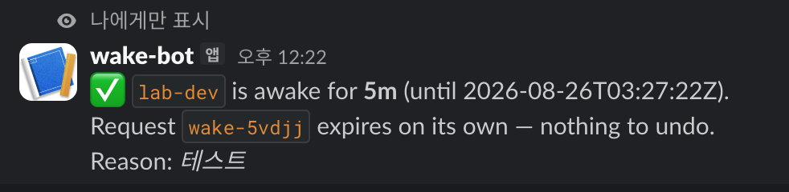
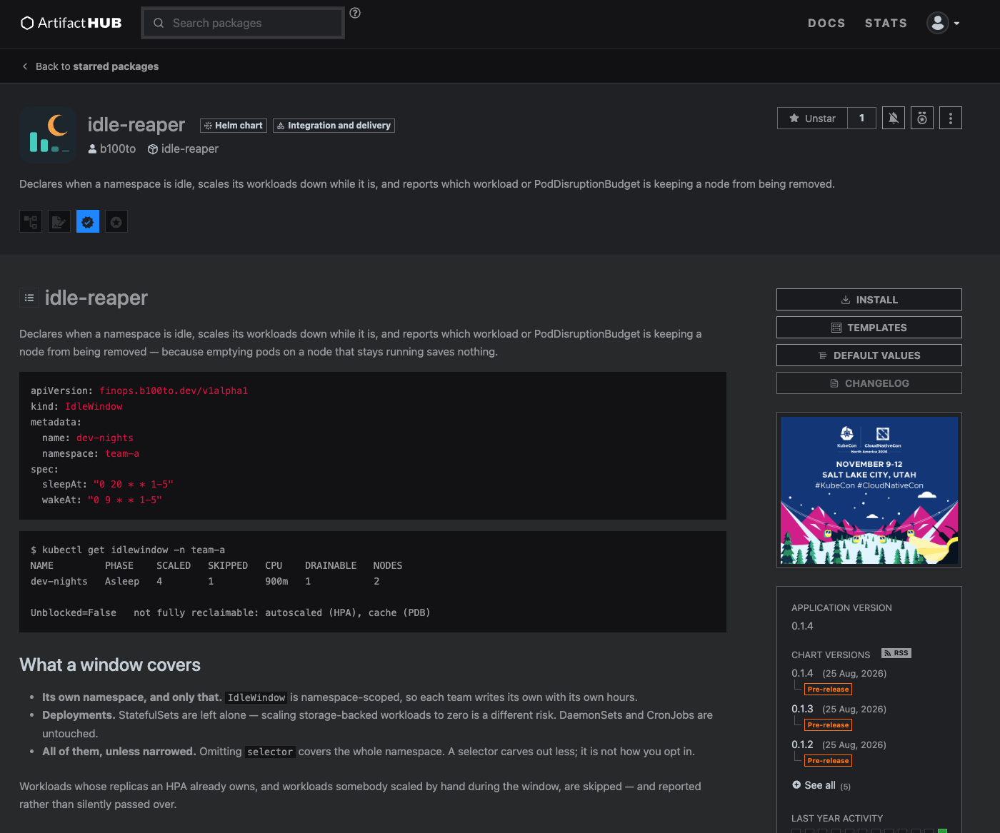

파드를 0으로 내려도 비용은 줄지 않습니다. 노드가 사라져야 줄어들고, 노드는 옮겨야 할 파드가 하나도 남지 않았을 때만 사라집니다.

dev 환경 야간·주말 스케일다운은 예전부터 EventBridge + Lambda로 처리하고 있었습니다. 동작은 했지만 두 가지가 계속 걸렸습니다.

---

## 1. 클러스터 밖에서 조작하는 것의 한계

**클러스터 안에서 무슨 일이 일어나는지 모릅니다.**

Lambda는 정해진 시각에 replica를 0으로 바꿉니다. 그런데 그 순간:

- 누가 장애 대응 중이라 파드를 켜놨는지 모릅니다
- HPA가 붙어 있는 워크로드인지 모릅니다
- 이미 0인지, 방금 배포됐는지 모릅니다

전부 "지금 클러스터가 어떤 상태인가"를 알아야 판단할 수 있는데, 밖에서는 매번 API를 뒤져야 합니다.

**설정이 개발자에게 보이지 않습니다.**

스케줄이 Lambda 코드나 환경변수 안에 있습니다. 개발자는 자기 네임스페이스가 몇 시에 꺼지는지 확인할 방법이 없고, 바꾸려면 DevOps에 요청해야 합니다.

**그리고 한 번 쏘고 끝입니다.**

Lambda가 20시에 실패하면 그날은 그냥 안 됩니다. 다음 실행까지 아무 일도 일어나지 않습니다.

---

## 2. 컨트롤러로 옮기면 달라지는 것

세 문제 모두 "바깥에서 이벤트로 조작한다"는 구조에서 나옵니다. 클러스터 안에서 **상태를 지속 조정**하는 방식으로 바꾸면 사라집니다.

```yaml
apiVersion: finops.b100to.dev/v1alpha1
kind: IdleWindow
metadata:
  name: dev-nights
  namespace: team-a
spec:
  sleepAt: "0 20 * * 1-5"
  wakeAt: "0 9 * * 1-5"
```

세 줄입니다. 나머지는 기본값이 채웁니다.

### level-triggered

컨트롤러의 `Reconcile`은 "왜 호출됐는지"를 구분하지 않습니다. 이벤트 때문인지, 주기 때문인지, 재시도인지 알 필요가 없습니다. 매번 **현재 시각과 현재 클러스터 상태를 새로 읽고** 맞춥니다.

그래서 이벤트를 놓쳐도, 컨트롤러가 재시작해도, 같은 호출이 중복돼도 결과가 같습니다.

여기서 재미있는 문제가 하나 있었습니다. cron은 **"다음에 언제 실행되나"**만 답합니다. 우리가 알고 싶은 건 **"지금이 두 시각 사이인가"**인데, 그걸 물어보는 함수가 없습니다.

과거를 역산하는 대신, 다음 경계 두 개를 비교했습니다.

```go
nextSleep := sleepSched.Next(now)
nextWake  := wakeSched.Next(now)

asleep := nextWake.Before(nextSleep)
```

다음 **기상**이 먼저 오면 지금은 자는 중입니다. 다음 **취침**이 먼저 오면 깨어 있는 중이고요.

| 지금 | 다음 취침 | 다음 기상 | 판정 |
|---|---|---|---|
| 08:59 | 오늘 20:00 | **오늘 09:00** | 자는 중 |
| 09:00 | **오늘 20:00** | 내일 09:00 | 깨어 있음 |
| 19:59 | **오늘 20:00** | 내일 09:00 | 깨어 있음 |
| 20:00 | 내일 20:00 | **내일 09:00** | 자는 중 |

경계를 지나는 순간 그쪽 "다음"이 하루 뒤로 밀리면서 순서가 뒤집힙니다.

**저장하는 상태가 하나도 없습니다.** 시계만 보면 판정됩니다. 그래서 09시 기상을 놓치고 10시에 재기동해도 첫 reconcile에서 바로 복구됩니다.

---

## 3. 원본 replica를 어디에 저장할 것인가

깨울 때 되돌릴 값이 필요합니다. 자연스러운 자리는 `IdleWindow`의 status인데, 그렇게 하지 않았습니다.

**IdleWindow를 지우거나 오퍼레이터가 사라지면 워크로드가 0에 갇힙니다.**

그래서 대상 Deployment의 annotation에 적습니다.

```
finops.b100to.dev/saved-replicas: "3"     # 원래 값
finops.b100to.dev/applied-replicas: "0"   # 컨트롤러가 마지막으로 쓴 값
```

오퍼레이터가 영영 안 돌아와도 사람이 값을 보고 되돌릴 수 있습니다.

`applied`를 따로 두는 이유는 **사람의 개입을 구분**하기 위해서입니다. 현재값이 `applied`와 다르면 컨트롤러가 아닌 누군가가 바꾼 것이고, 그럴 땐 다음 경계까지 물러섭니다.

새벽 3시에 장애로 파드를 켠 사람을 자동화가 5분 뒤 다시 끄면 그건 사고입니다.

---

## 4. 회수량만 보고하면 절감을 알 수 없다

여기가 이 프로젝트에서 제일 신경 쓴 부분입니다.

파드를 0으로 만들었다고 돈이 줄지 않습니다. 노드가 사라져야 줄고, 노드는 Karpenter나 Cluster Autoscaler가 치웁니다. 그런데 **왜 안 치워졌는지**는 아무도 말해주지 않습니다.

```
$ kubectl get idlewindow -n team-a
NAME         PHASE    SCALED   SKIPPED   CPU    DRAINABLE   NODES
dev-nights   Asleep   4        1         900m   0           2

Unblocked=False
  not fully reclaimable: autoscaled (HPA), cache (PDB)
```

워크로드 4개는 0으로 내려갔는데 `DRAINABLE`이 0입니다. 노드를 들여다보면 이유가 보입니다.

```
lab-worker    [infra]  idle-reaper  wake-bot  kindnet  kube-proxy
lab-worker2   [app]    autoscaled   kindnet   kube-proxy
lab-worker3   [app]    autoscaled   kindnet   kube-proxy
```

HPA가 붙어 건너뛴 워크로드 하나가 replica 2개로 **app 노드 두 대에 하나씩** 걸쳐 있습니다. 나머지를 전부 비웠어도 노드는 한 대도 못 치웁니다.

파드는 내렸는데 노드가 안 비었다면 이유가 있습니다. HPA가 replica를 쥐고 있거나, PodDisruptionBudget이 evict를 막고 있거나.

숫자만 보여주면 **"고장난 건지 원래 그런 건지"** 구분이 안 됩니다.

노드 판정 기준은 오토스케일러와 같게 맞췄습니다. **DaemonSet 파드는 제외**합니다. 다른 노드로 옮길 대상이 아니라 노드와 함께 사라지기 때문이고, Karpenter의 consolidation과 CA의 scale-down이 쓰는 규칙과 동일합니다.

---

## 5. 새벽에 일해야 하는 사람

유휴 창을 걷어낼 방법이 필요합니다. 그런데 `IdleWindow`를 직접 고치게 하면 정책 파일을 사용자가 건드리는 셈이고, 되돌리는 걸 잊으면 그 네임스페이스는 영원히 깨어 있게 됩니다.

별도 오브젝트로 분리했습니다.

```yaml
kind: WakeRequest
spec:
  duration: 3h
  reason: "결제 핫픽스 검증"
```

- **만료 시각은 spec이 아니라 생성 시각에서 유도합니다.** 끝 시각을 적을 수 있으면 연장도 할 수 있고, 스스로 끝나는 것이 이 오브젝트의 존재 이유입니다.
- **상한은 정책이 강제합니다.** `IdleWindow.maxWakeDuration`(기본 8h)을 넘는 요청은 거부됩니다.

RBAC이 소유권을 그대로 표현합니다. 개발자에게는 `wakerequests`의 `create`만 주면 됩니다. 정책은 읽지도 못합니다.

### Slack에서

```
/wake 5m 테스트
```



봇이 답한 만료 시각은 봇이 계산한 값이 아닙니다. 오브젝트를 만든 뒤 **컨트롤러의 판정을 기다렸다가** 그 결과를 옮긴 것입니다.

처음에는 생성 성공을 그대로 성공으로 보고했는데, `24h`를 요청했을 때 봇이 "24시간 깨어 있습니다"라고 답했습니다. 실제로는 `maxWakeDuration` 8시간을 넘겨 거부됐고 네임스페이스는 계속 자고 있었습니다. **정책은 지켜졌지만 사람에게는 반대로 말한 셈**이었습니다.

오브젝트 생성과 수락은 다릅니다. API 서버는 형태만 보고, 기간이 허용되는지는 컨트롤러가 잠시 뒤에 판단합니다.

봇은 아무것도 결정하지 않습니다. 문장을 오브젝트로 옮기고, 클러스터가 뭐라 했는지 되돌려줄 뿐입니다.

봇이 뚫려도 할 수 있는 최대치는 **자기 네임스페이스에 "깨워달라"고 요청하는 것**입니다.

```bash
$ kubectl auth can-i update idlewindows -n lab-dev \
    --as=system:serviceaccount:idle-reaper-system:wake-bot
no
```

---

## 6. 만들면서 부딪힌 것들

여기부터가 실제로 시간을 쓴 부분입니다.

### "Deployment를 만들어도 파드가 안 뜹니다"

로컬 kind 클러스터에서 ReplicaSet조차 생기지 않았습니다. 추적해보니 `kube-controller-manager`가 17번 재시작 중이었습니다.

```
E controllermanager.go:368] "leaderelection lost"
```

ReplicaSet 컨트롤러가 그 안에 있어서 아무것도 생성되지 않았던 겁니다. 원인은 더 아래에 있었습니다.

```
"apply request took too long","took":"285ms","expected-duration":"100ms"
```

macOS 컨테이너 파일시스템의 etcd fsync 지연이었습니다. 최근 300줄 중 96회가 경고였고, lease 갱신이 타임아웃했습니다. CPU·메모리는 여유였습니다.

**증상과 원인이 두 계층 떨어져 있습니다.** "파드가 안 뜬다"에서 "etcd 디스크가 느리다"까지 가는 데 시간이 걸렸습니다.

kind 설정 두 줄로 해결했습니다.

- etcd `dataDir`을 `/tmp/etcd`로 (kind 노드는 `/tmp`가 tmpfs)
- 컨트롤플레인이 하나뿐이므로 leader election 끄기

지연 경고 96회 → 1회, 노드 전체 Ready까지 7분 → 1분.

### RBAC은 클러스터에 올려야만 드러난다

로컬에서 `make run`으로 잘 돌던 컨트롤러가 클러스터에서는 이랬습니다.

```
cannot list resource "wakerequests" ... at the cluster scope
```

RBAC 마커는 맞았고 `config/rbac/role.yaml`도 최신이었습니다. 문제는 **`make manifests`가 Helm 차트를 갱신하지 않는다**는 것이었습니다.

더 중요한 건 이겁니다. **로컬 실행은 admin kubeconfig를 쓰므로 권한이 부족해도 알 수 없습니다.** 컨트롤러의 ServiceAccount로 실제로 돌려봐야만 드러납니다.

### 회수에 성공한 순간 울리는 경보

PDB가 노드 회수를 막는지 판정할 때 `status.disruptionsAllowed == 0`만 봤습니다. 그랬더니 워크로드가 0으로 내려간 순간 — 즉 **회수에 성공한 순간** — 경보가 떴습니다.

파드가 0개면 PDB는 아무것도 막지 않습니다. `currentHealthy > 0`을 함께 봐야 합니다.

### kubelet이 거부하는 라벨

노드에 역할을 붙이려고 kind 설정에 이렇게 썼습니다.

```yaml
labels:
  node-role.kubernetes.io/infra: ""
```

클러스터가 아예 뜨지 않았습니다. 에러는 엉뚱한 곳에서 났습니다.

```
could not find a JWS signature in the cluster-info ConfigMap
```

kind의 `labels:`는 kubelet이 등록 시 자기에게 붙이는 것인데, **NodeRestriction admission이 `node-role.kubernetes.io/` 접두사를 거부합니다.** 등록이 실패하니 join 단계에서 무관해 보이는 메시지로 죽었습니다.

커스텀 도메인(`platform-lab.dev/role`)으로 바꿔 해결했습니다. taint는 `JoinConfiguration.nodeRegistration.taints`로 문제없이 걸립니다.

### 오퍼레이터는 자기가 비우는 노드에 있으면 안 된다

앱 노드를 0으로 내리면 그 위에 있던 컨트롤러도 사라집니다. 그러면 아침에 깨워줄 주체가 없습니다.

Karpenter가 자신을 별도 노드그룹이나 Fargate에 두는 것과 같은 이유입니다. 랩에서는 워커 한 대를 infra로 두고 taint를 걸었습니다.

```yaml
# clusters/kind/kind-config.yaml
- role: worker
  labels:
    platform-lab.dev/role: infra
  kubeadmConfigPatches:
    - |
      kind: JoinConfiguration
      nodeRegistration:
        taints:
          - key: dedicated
            value: infra
            effect: NoSchedule
```

### 차트만 올리는 건 절반만 배포하는 것

Artifact Hub에 등록하고 나서 취약점 스캔이 실패했습니다.

```
error scanning image controller:0.1.0: image not found
```

kubebuilder의 자리표시자 `controller`가 values.yaml 기본값으로 그대로 게시돼 있었습니다. 스캔 실패는 증상이고, 실제 문제는 **이 차트를 설치하는 사람이 `ImagePullBackOff`를 만난다**는 것이었습니다.

우리 랩은 로컬 이미지로 덮어쓰고 있어서 이 결함을 가리고 있었습니다.

**외부 스캐너가 처음으로 "남처럼" 설치를 시도한 것**이었습니다.

---

## 7. 배포

Helm 차트로 패키징해 OCI 레지스트리에 게시했습니다.

```sh
helm install idle-reaper oci://ghcr.io/b100to/charts/idle-reaper \
  --namespace idle-reaper-system --create-namespace
```

GitHub Pages 방식과 달리 `index.yaml`과 gh-pages 브랜치를 따로 관리하지 않고, 이미지와 같은 레지스트리·같은 인증 경로를 씁니다.



---

## 마치며

운영 적용 전, 로컬에서 설계 검증까지 마쳤습니다. 4노드 kind 클러스터에서 축소·복원·재시작 복구·수동 변경 존중·요청 만료를 확인했고, 자격증명 없는 환경에서 차트가 설치되는 것까지 봤습니다.

이번 작업에서 세 번 같은 일이 있었습니다. **"내 환경에서는 됐다"가 가려준 결함**이 실제 환경에서 드러난 것입니다.

- 로컬 `go run`은 admin 권한이라 RBAC 부족을 가렸습니다
- 로컬 values 오버라이드는 차트의 기본 이미지 결함을 가렸습니다
- Slack에서 실제로 쳐보기 전까지 봇이 잘못 답하는 걸 몰랐습니다

만드는 것보다 **남처럼 써보는 것**이 더 많은 걸 알려줬습니다.

---

**코드**: [github.com/b100to/platform-lab](https://github.com/b100to/platform-lab/tree/main/operators/idle-reaper) — 설계 결정과 그중 틀렸던 것들을 `DESIGN.md`에 적어뒀습니다.

**차트**: [artifacthub.io/packages/helm/idle-reaper/idle-reaper](https://artifacthub.io/packages/helm/idle-reaper/idle-reaper)
